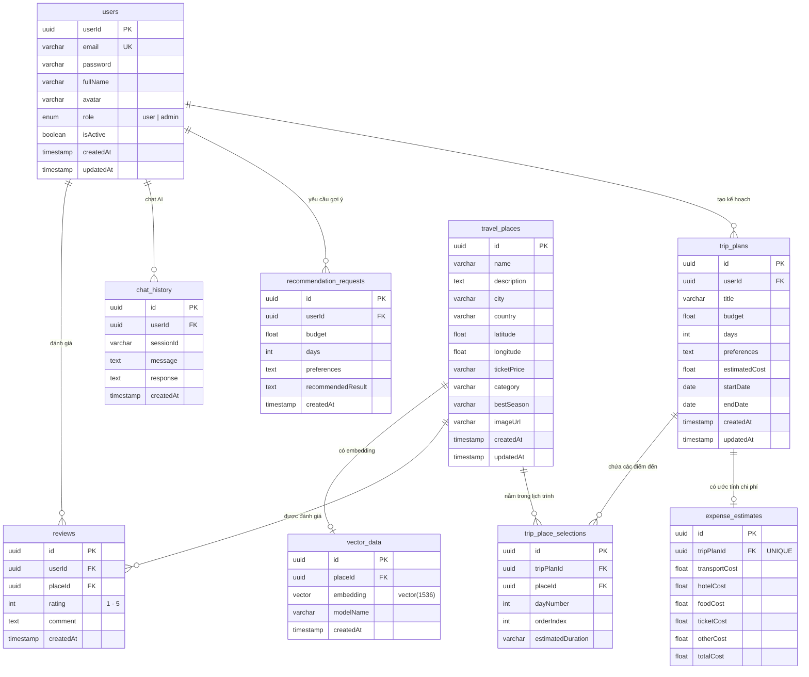

# 📐 DATABASE DESIGN — TravelAI

> **Phiên bản:** 1.0  
> **Ngày tạo:** 01/07/2026  
> **Loại tài liệu:** Database Design Document  
> **DBMS:** PostgreSQL + pgvector Extension  

---

## 1. Tổng quan

Hệ thống TravelAI sử dụng **9 bảng dữ liệu**, được chia thành 4 nhóm chức năng:

| Nhóm | Bảng | Mô tả |
|------|------|-------|
| **Người dùng** | `users` | Tài khoản người dùng |
| **Địa điểm** | `travel_places`, `vector_data` | Dữ liệu địa điểm + embedding AI |
| **Tương tác** | `reviews`, `chat_history`, `recommendation_requests` | Đánh giá, chat, gợi ý |
| **Lịch trình** | `trip_plans`, `trip_place_selections`, `expense_estimates` | Kế hoạch du lịch + chi phí |

---

## 2. Sơ đồ ERD — Quan hệ giữa các bảng

---

## 3. Chi tiết từng bảng

---

### 3.1. Bảng `users`

> Lưu thông tin tài khoản người dùng.

| Cột | Kiểu dữ liệu | Ràng buộc | Mô tả |
|-----|---------------|-----------|-------|
| `userId` | `UUID` | PK, auto-gen | Khóa chính |
| `email` | `VARCHAR(255)` | UNIQUE, NOT NULL | Email đăng nhập |
| `password` | `VARCHAR(255)` | NOT NULL | Mật khẩu (bcrypt hash) |
| `fullName` | `VARCHAR(255)` | nullable | Họ tên đầy đủ |
| `avatar` | `VARCHAR(500)` | nullable | URL ảnh đại diện |
| `role` | `ENUM('user','admin')` | NOT NULL, DEFAULT `'user'` | Vai trò phân quyền |
| `isActive` | `BOOLEAN` | NOT NULL, DEFAULT `true` | Trạng thái tài khoản |
| `createdAt` | `TIMESTAMP` | auto | Ngày tạo |
| `updatedAt` | `TIMESTAMP` | auto | Ngày cập nhật |

**Index:** `UNIQUE(email)`

---

### 3.2. Bảng `travel_places`

> Lưu thông tin địa điểm du lịch.

| Cột | Kiểu dữ liệu | Ràng buộc | Mô tả |
|-----|---------------|-----------|-------|
| `id` | `UUID` | PK, auto-gen | Khóa chính |
| `name` | `VARCHAR(255)` | NOT NULL | Tên địa điểm |
| `description` | `TEXT` | NOT NULL | Mô tả chi tiết |
| `city` | `VARCHAR(255)` | nullable | Thành phố / tỉnh |
| `country` | `VARCHAR(255)` | nullable | Quốc gia |
| `latitude` | `FLOAT` | nullable | Vĩ độ (bản đồ) |
| `longitude` | `FLOAT` | nullable | Kinh độ (bản đồ) |
| `ticketPrice` | `VARCHAR(100)` | nullable | Giá vé (VD: "80.000đ", "Miễn phí") |
| `category` | `VARCHAR(100)` | nullable | Loại hình: beach, mountain, city, heritage |
| `bestSeason` | `VARCHAR(255)` | nullable | Mùa tốt nhất để đến |
| `imageUrl` | `VARCHAR(500)` | nullable | URL ảnh đại diện địa điểm |
| `createdAt` | `TIMESTAMP` | auto | Ngày tạo |
| `updatedAt` | `TIMESTAMP` | auto | Ngày cập nhật |

---

### 3.3. Bảng `vector_data`

> Lưu vector embedding tách riêng khỏi bảng địa điểm. Cho phép quản lý model embedding linh hoạt.

| Cột | Kiểu dữ liệu | Ràng buộc | Mô tả |
|-----|---------------|-----------|-------|
| `id` | `UUID` | PK, auto-gen | Khóa chính |
| `placeId` | `UUID` | FK → `travel_places.id`, UNIQUE | Địa điểm tương ứng |
| `embedding` | `vector(1536)` | nullable | Vector embedding (pgvector) |
| `modelName` | `VARCHAR(100)` | nullable | Tên model đã dùng (VD: text-embedding-3-small) |
| `createdAt` | `TIMESTAMP` | auto | Ngày tạo embedding |

**Quan hệ:** `travel_places` 1:1 `vector_data` (qua `placeId`)

---

### 3.4. Bảng `reviews`

> Đánh giá và nhận xét của người dùng cho địa điểm.

| Cột | Kiểu dữ liệu | Ràng buộc | Mô tả |
|-----|---------------|-----------|-------|
| `id` | `UUID` | PK, auto-gen | Khóa chính |
| `userId` | `UUID` | FK → `users.userId`, NOT NULL | Người đánh giá |
| `placeId` | `UUID` | FK → `travel_places.id`, NOT NULL | Địa điểm được đánh giá |
| `rating` | `INT` | NOT NULL, CHECK(1-5) | Điểm đánh giá |
| `comment` | `TEXT` | nullable | Nhận xét |
| `createdAt` | `TIMESTAMP` | auto | Ngày đánh giá |

**Constraint:** `UNIQUE(userId, placeId)` — Mỗi user chỉ đánh giá 1 lần / địa điểm

---

### 3.5. Bảng `chat_history`

> Lịch sử trò chuyện giữa người dùng và AI.

| Cột | Kiểu dữ liệu | Ràng buộc | Mô tả |
|-----|---------------|-----------|-------|
| `id` | `UUID` | PK, auto-gen | Khóa chính |
| `userId` | `UUID` | FK → `users.userId`, NOT NULL | Người gửi |
| `sessionId` | `VARCHAR(255)` | NOT NULL | Nhóm các tin nhắn cùng phiên |
| `message` | `TEXT` | NOT NULL | Câu hỏi của user |
| `response` | `TEXT` | NOT NULL | Câu trả lời của AI |
| `createdAt` | `TIMESTAMP` | auto | Thời điểm chat |

**Index:** `INDEX(userId, sessionId)` — Truy vấn nhanh theo phiên

---

### 3.6. Bảng `recommendation_requests`

> Lưu yêu cầu gợi ý du lịch từ AI.

| Cột | Kiểu dữ liệu | Ràng buộc | Mô tả |
|-----|---------------|-----------|-------|
| `id` | `UUID` | PK, auto-gen | Khóa chính |
| `userId` | `UUID` | FK → `users.userId`, NOT NULL | Người yêu cầu |
| `budget` | `FLOAT` | nullable | Ngân sách (VNĐ) |
| `days` | `INT` | nullable | Số ngày du lịch |
| `preferences` | `TEXT` | nullable | Sở thích / yêu cầu đặc biệt |
| `recommendedResult` | `TEXT` | nullable | Kết quả gợi ý từ AI (JSON/Text) |
| `createdAt` | `TIMESTAMP` | auto | Thời điểm gửi yêu cầu |

---

### 3.7. Bảng `trip_plans`

> Kế hoạch / lịch trình du lịch do người dùng tạo.

| Cột | Kiểu dữ liệu | Ràng buộc | Mô tả |
|-----|---------------|-----------|-------|
| `id` | `UUID` | PK, auto-gen | Khóa chính |
| `userId` | `UUID` | FK → `users.userId`, NOT NULL | Người tạo |
| `title` | `VARCHAR(255)` | nullable | Tiêu đề kế hoạch |
| `budget` | `FLOAT` | nullable | Ngân sách dự kiến |
| `days` | `INT` | nullable | Số ngày |
| `preferences` | `TEXT` | nullable | Sở thích |
| `estimatedCost` | `FLOAT` | nullable | Chi phí ước tính |
| `startDate` | `DATE` | nullable | Ngày bắt đầu |
| `endDate` | `DATE` | nullable | Ngày kết thúc |
| `createdAt` | `TIMESTAMP` | auto | Ngày tạo |
| `updatedAt` | `TIMESTAMP` | auto | Ngày cập nhật |

---

### 3.8. Bảng `trip_place_selections`

> Danh sách địa điểm được chọn trong từng ngày của lịch trình.

| Cột | Kiểu dữ liệu | Ràng buộc | Mô tả |
|-----|---------------|-----------|-------|
| `id` | `UUID` | PK, auto-gen | Khóa chính |
| `tripPlanId` | `UUID` | FK → `trip_plans.id`, NOT NULL | Kế hoạch chứa |
| `placeId` | `UUID` | FK → `travel_places.id`, NOT NULL | Địa điểm được chọn |
| `dayNumber` | `INT` | NOT NULL | Ngày thứ mấy (1, 2, 3...) |
| `orderIndex` | `INT` | NOT NULL | Thứ tự trong ngày (1, 2, 3...) |
| `estimatedDuration` | `VARCHAR(100)` | nullable | Thời gian dự kiến (VD: "2 giờ") |

---

### 3.9. Bảng `expense_estimates`

> Ước tính chi phí chi tiết cho kế hoạch du lịch.

| Cột | Kiểu dữ liệu | Ràng buộc | Mô tả |
|-----|---------------|-----------|-------|
| `id` | `UUID` | PK, auto-gen | Khóa chính |
| `tripPlanId` | `UUID` | FK → `trip_plans.id`, UNIQUE | Kế hoạch tương ứng (1:1) |
| `transportCost` | `FLOAT` | nullable, DEFAULT 0 | Chi phí di chuyển |
| `hotelCost` | `FLOAT` | nullable, DEFAULT 0 | Chi phí khách sạn |
| `foodCost` | `FLOAT` | nullable, DEFAULT 0 | Chi phí ăn uống |
| `ticketCost` | `FLOAT` | nullable, DEFAULT 0 | Chi phí vé tham quan |
| `otherCost` | `FLOAT` | nullable, DEFAULT 0 | Chi phí khác |
| `totalCost` | `FLOAT` | nullable, DEFAULT 0 | Tổng chi phí |

---

## 4. Tổng hợp quan hệ

| Bảng nguồn | Quan hệ | Bảng đích | FK |
|------------|---------|-----------|-----|
| `users` | 1 : N | `reviews` | `reviews.userId` |
| `users` | 1 : N | `chat_history` | `chat_history.userId` |
| `users` | 1 : N | `recommendation_requests` | `recommendation_requests.userId` |
| `users` | 1 : N | `trip_plans` | `trip_plans.userId` |
| `travel_places` | 1 : 1 | `vector_data` | `vector_data.placeId` |
| `travel_places` | 1 : N | `reviews` | `reviews.placeId` |
| `travel_places` | 1 : N | `trip_place_selections` | `trip_place_selections.placeId` |
| `trip_plans` | 1 : N | `trip_place_selections` | `trip_place_selections.tripPlanId` |
| `trip_plans` | 1 : 1 | `expense_estimates` | `expense_estimates.tripPlanId` |

---

## 5. Indexes đề xuất

| Bảng | Cột | Loại Index | Lý do |
|------|-----|------------|-------|
| `users` | `email` | UNIQUE | Đảm bảo email không trùng |
| `reviews` | `(userId, placeId)` | UNIQUE | Mỗi user đánh giá 1 lần / địa điểm |
| `chat_history` | `(userId, sessionId)` | INDEX | Truy vấn nhanh theo phiên chat |
| `vector_data` | `placeId` | UNIQUE | 1 place = 1 embedding |
| `vector_data` | `embedding` | HNSW/IVFFlat | Tăng tốc vector search (khi dữ liệu lớn) |
| `trip_place_selections` | `tripPlanId` | INDEX | Lấy nhanh danh sách điểm đến |
| `expense_estimates` | `tripPlanId` | UNIQUE | 1 plan = 1 expense |
| `travel_places` | `category` | INDEX | Filter theo loại hình |

---

*Tài liệu được tạo cho dự án TravelAI — Phiên bản 1.0*
