# 📘 TravelAI — Đặc Tả Tổng Quan Dự Án

> **Phiên bản:** 1.0  
> **Ngày tạo:** 01/07/2026  
> **Loại tài liệu:** Business Analysis & Solution Architecture  
> **Trạng thái:** Draft  

---

## Mục lục

- [1. Giới thiệu dự án](#1-giới-thiệu-dự-án)
- [2. Đối tượng sử dụng (Stakeholders)](#2-đối-tượng-sử-dụng-stakeholders)
- [3. Phân tích bài toán](#3-phân-tích-bài-toán)
- [4. Mục tiêu chức năng](#4-mục-tiêu-chức-năng)
- [5. Yêu cầu phi chức năng](#5-yêu-cầu-phi-chức-năng)
- [6. Quy tắc nghiệp vụ](#6-quy-tắc-nghiệp-vụ)
- [7. Luồng hoạt động tổng quát](#7-luồng-hoạt-động-tổng-quát)
- [8. Luồng AI](#8-luồng-ai)
- [9. Luồng RAG](#9-luồng-rag)
- [10. Kiến trúc tổng quan](#10-kiến-trúc-tổng-quan)
- [11. Luồng dữ liệu](#11-luồng-dữ-liệu)
- [12. Các giả định và ràng buộc](#12-các-giả-định-và-ràng-buộc)
- [13. Hướng phát triển](#13-hướng-phát-triển)

---

## 1. Giới thiệu dự án

### 1.1. Bối cảnh

Trong bối cảnh ngành du lịch Việt Nam đang phục hồi mạnh mẽ sau đại dịch, nhu cầu của du khách ngày càng đa dạng và phức tạp hơn. Người dùng không chỉ muốn tìm kiếm thông tin về địa điểm du lịch mà còn mong muốn được tư vấn cá nhân hóa, lập kế hoạch chi tiết và ước tính chi phí chuyến đi một cách nhanh chóng, chính xác.

Sự phát triển vượt bậc của trí tuệ nhân tạo (AI), đặc biệt là các mô hình ngôn ngữ lớn (LLM — Large Language Model), đã mở ra khả năng xây dựng các trợ lý ảo có khả năng hiểu và phản hồi ngôn ngữ tự nhiên. Tuy nhiên, khi sử dụng LLM thuần túy (không kết hợp với nguồn dữ liệu nội bộ), AI có xu hướng **sinh ra thông tin sai lệch (hallucination)** — tức là trả lời rất tự tin nhưng nội dung không đúng sự thật hoặc không có cơ sở.

Mô hình **RAG (Retrieval-Augmented Generation)** ra đời để giải quyết vấn đề này: thay vì để LLM tự do sinh câu trả lời, RAG yêu cầu hệ thống truy xuất các tài liệu liên quan từ cơ sở dữ liệu trước, sau đó truyền ngữ cảnh này vào LLM để sinh câu trả lời có căn cứ.

### 1.2. Lý do thực hiện

| STT | Lý do | Mô tả |
|-----|-------|-------|
| 1 | **Nhu cầu thực tế** | Người dùng cần một công cụ thông minh hỗ trợ lập kế hoạch du lịch thay vì phải tự tìm kiếm trên nhiều nền tảng khác nhau |
| 2 | **Hạn chế của giải pháp hiện tại** | Các website du lịch truyền thống chỉ cung cấp thông tin tĩnh, thiếu khả năng tương tác và cá nhân hóa |
| 3 | **Rủi ro của AI thuần túy** | Chatbot AI không sử dụng RAG có thể sinh ra thông tin sai về địa điểm, giá cả, mùa du lịch — gây nguy hiểm cho trải nghiệm người dùng |
| 4 | **Xu hướng công nghệ** | RAG đang trở thành tiêu chuẩn trong việc xây dựng các ứng dụng AI đáng tin cậy cho doanh nghiệp |
| 5 | **Tiềm năng thương mại** | Một nền tảng du lịch AI thông minh có khả năng mở rộng sang booking, quảng cáo và các dịch vụ giá trị gia tăng |

### 1.3. Bài toán cần giải quyết

**Bài toán cốt lõi:** Xây dựng một hệ thống web du lịch thông minh, trong đó AI **chỉ được phép trả lời dựa trên dữ liệu thực tế của hệ thống**, đảm bảo tính chính xác và đáng tin cậy của thông tin cung cấp cho người dùng.

Cụ thể, hệ thống cần giải quyết các bài toán con:

1. **Bài toán tìm kiếm ngữ nghĩa (Semantic Search):** Cho phép người dùng tìm kiếm địa điểm bằng ngôn ngữ tự nhiên thay vì từ khóa chính xác. Ví dụ: _"nơi nào ở miền Trung có biển đẹp?"_ thay vì phải gõ _"bãi biển Đà Nẵng"_.

2. **Bài toán trả lời có căn cứ (Grounded Answering):** AI trả lời câu hỏi phải kèm theo nguồn dữ liệu tham khảo, giúp người dùng xác minh thông tin.

3. **Bài toán lập kế hoạch du lịch (Trip Planning):** Hệ thống có khả năng gợi ý lịch trình phù hợp dựa trên sở thích, thời gian và ngân sách của người dùng.

4. **Bài toán ước tính chi phí (Cost Estimation):** Dựa trên dữ liệu thực tế để ước tính chi phí cho từng chuyến đi.

5. **Bài toán quản trị tri thức (Knowledge Management):** Quản trị viên có thể thêm, sửa, xóa dữ liệu địa điểm và hệ thống tự động cập nhật vector embedding tương ứng.

### 1.4. Mục tiêu dự án

| Loại mục tiêu | Nội dung |
|----------------|----------|
| **Mục tiêu kinh doanh** | Xây dựng nền tảng du lịch AI tiên phong, tạo nền tảng để mở rộng các dịch vụ giá trị gia tăng trong tương lai |
| **Mục tiêu kỹ thuật** | Thiết kế và triển khai hệ thống RAG hoàn chỉnh, đảm bảo chất lượng câu trả lời AI dựa trên dữ liệu thực |
| **Mục tiêu người dùng** | Cung cấp trải nghiệm tìm kiếm, khám phá và lập kế hoạch du lịch nhanh chóng, chính xác và cá nhân hóa |
| **Mục tiêu học thuật** | Ứng dụng các kiến thức về AI, NLP, Vector Database, System Design vào một sản phẩm thực tế hoàn chỉnh |

### 1.5. Phạm vi dự án

#### Trong phạm vi (In Scope)

- Hệ thống web gồm Frontend (Next.js) và Backend (NestJS)
- Quản lý người dùng: đăng ký, đăng nhập, phân quyền
- Quản lý dữ liệu địa điểm du lịch Việt Nam (CRUD)
- Hệ thống Embedding & Vector Database (pgvector)
- Tìm kiếm ngữ nghĩa (Semantic Search)
- Chat AI với mô hình RAG
- Gợi ý lịch trình du lịch
- Ước tính chi phí chuyến đi
- Hiển thị bản đồ vị trí địa điểm
- Lưu địa điểm yêu thích
- Đánh giá và nhận xét địa điểm
- Dashboard quản trị
- Triển khai bằng Docker & Docker Compose

#### Ngoài phạm vi (Out of Scope)

- Tích hợp cổng thanh toán trực tuyến
- Đặt phòng khách sạn
- Đặt vé máy bay / tàu xe
- Ứng dụng di động (Mobile App)
- Hỗ trợ đa ngôn ngữ (chỉ hỗ trợ tiếng Việt trong phiên bản đầu)

### 1.6. Giá trị mang lại

| Đối tượng | Giá trị |
|-----------|---------|
| **Người dùng cuối** | Tiết kiệm thời gian tìm kiếm và lập kế hoạch du lịch; nhận được thông tin chính xác, đáng tin cậy từ AI |
| **Quản trị viên** | Dễ dàng quản lý và cập nhật cơ sở tri thức du lịch; hệ thống tự động đồng bộ embedding |
| **Ngành du lịch** | Thúc đẩy ứng dụng AI có trách nhiệm trong du lịch, giảm thiểu thông tin sai lệch |
| **Cộng đồng kỹ thuật** | Cung cấp một mẫu tham khảo (reference architecture) cho việc xây dựng ứng dụng RAG với NestJS, pgvector và OpenAI |

---

## 2. Đối tượng sử dụng (Stakeholders)

### 2.1. Tổng quan các vai trò

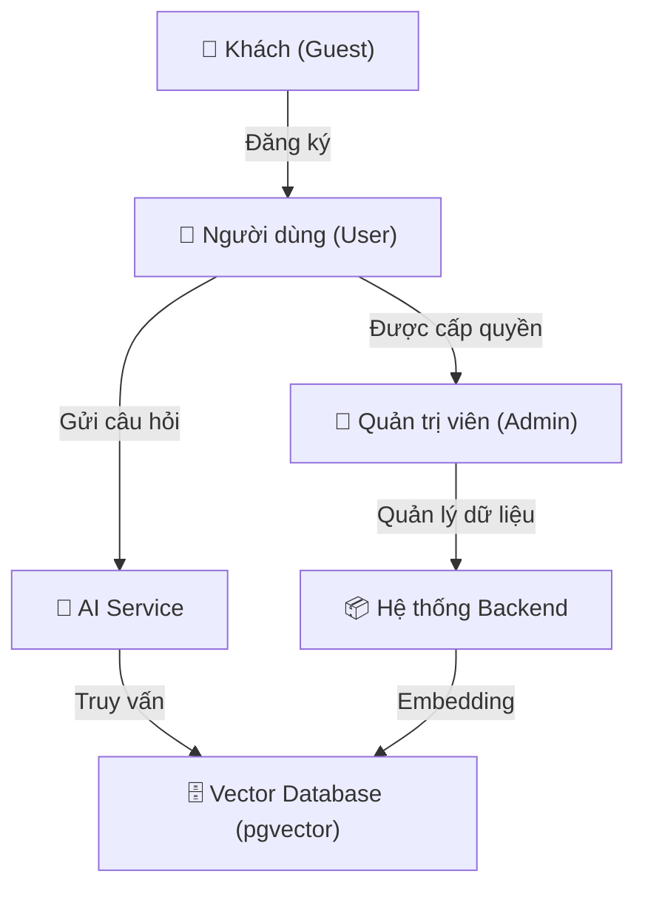

### 2.2. Chi tiết từng vai trò

#### 2.2.1. Khách (Guest)

| Thuộc tính | Mô tả |
|------------|-------|
| **Định nghĩa** | Người truy cập hệ thống mà chưa đăng nhập |
| **Đặc điểm** | Có thể duyệt thông tin công khai nhưng bị giới hạn quyền truy cập |
| **Quyền hạn** | Xem danh sách địa điểm, tìm kiếm cơ bản, xem chi tiết địa điểm, xem bản đồ |
| **Hạn chế** | Không thể chat AI, đánh giá, lưu yêu thích, xem lịch trình gợi ý |
| **Mục tiêu** | Khám phá hệ thống trước khi quyết định đăng ký tài khoản |

#### 2.2.2. Người dùng (User)

| Thuộc tính | Mô tả |
|------------|-------|
| **Định nghĩa** | Người dùng đã đăng ký và đăng nhập vào hệ thống |
| **Đặc điểm** | Có đầy đủ quyền truy cập các tính năng dành cho người dùng cuối |
| **Quyền hạn** | Tất cả quyền của Guest + Chat AI, đánh giá địa điểm, lưu yêu thích, xem gợi ý lịch trình, ước tính chi phí |
| **Thông tin lưu trữ** | `userId`, `fullName`, `username`, `email`, `password` (hashed), `phoneNumber`, `avatarPath`, `avatarUrl`, `isActive` |
| **Mục tiêu** | Nhận được sự hỗ trợ tối đa từ AI để lập kế hoạch du lịch |

#### 2.2.3. Quản trị viên (Admin)

| Thuộc tính | Mô tả |
|------------|-------|
| **Định nghĩa** | Người quản lý hệ thống, có quyền truy cập vào Dashboard quản trị |
| **Đặc điểm** | Chịu trách nhiệm quản lý dữ liệu địa điểm, người dùng và cơ sở tri thức AI |
| **Quyền hạn** | Tất cả quyền của User + CRUD địa điểm, quản lý người dùng, Index/Reindex embedding, xem thống kê hệ thống |
| **Mục tiêu** | Đảm bảo dữ liệu hệ thống luôn chính xác, đầy đủ và được cập nhật embedding |

#### 2.2.4. AI Service

| Thuộc tính | Mô tả |
|------------|-------|
| **Định nghĩa** | Thành phần phần mềm thực hiện các tác vụ AI: Embedding, Semantic Search, sinh câu trả lời |
| **Đặc điểm** | Hoạt động như một actor nội bộ, được gọi bởi Backend khi người dùng gửi câu hỏi hoặc khi dữ liệu được cập nhật |
| **Công nghệ** | OpenAI API — Model `text-embedding-3-small` (Embedding, 1536 dimensions) + `gpt-4o-mini` (Chat Completion) |
| **Nguyên tắc** | Chỉ sinh câu trả lời dựa trên ngữ cảnh được cung cấp từ Vector Database; không tự do sáng tạo nội dung |
| **Mục tiêu** | Đảm bảo câu trả lời chính xác, có nguồn tham khảo, không hallucination |

#### 2.2.5. Hệ thống Vector Database (pgvector)

| Thuộc tính | Mô tả |
|------------|-------|
| **Định nghĩa** | Thành phần lưu trữ và truy vấn vector embedding, được tích hợp trực tiếp trong PostgreSQL thông qua extension pgvector |
| **Đặc điểm** | Lưu trữ embedding dạng `vector(1536)` cùng bảng dữ liệu địa điểm; hỗ trợ phép tính cosine distance (`<=>`) |
| **Vai trò** | Nhận truy vấn từ AI Service, thực hiện Similarity Search và trả về Top-K tài liệu có độ tương đồng cao nhất |
| **Mục tiêu** | Cung cấp ngữ cảnh chính xác cho LLM trong thời gian thực |

---

## 3. Phân tích bài toán

### 3.1. Thực trạng hiện nay

Ngành du lịch Việt Nam đang phát triển mạnh mẽ với hàng triệu lượt du khách nội địa và quốc tế mỗi năm. Tuy nhiên, quá trình tìm kiếm và lập kế hoạch du lịch vẫn còn nhiều bất cập:

1. **Thông tin phân tán:** Thông tin về các địa điểm du lịch nằm rải rác trên nhiều nền tảng khác nhau (blog cá nhân, diễn đàn, mạng xã hội, website du lịch). Người dùng phải dành nhiều thời gian để tổng hợp và đối chiếu thông tin.

2. **Thiếu tính cá nhân hóa:** Các nền tảng du lịch hiện tại thường cung cấp thông tin chung chung, không điều chỉnh theo nhu cầu cụ thể (ngân sách, thời gian, sở thích) của từng người dùng.

3. **Thông tin lỗi thời:** Nhiều bài viết review, giá vé, giờ mở cửa không được cập nhật, dẫn đến trải nghiệm thực tế khác xa kỳ vọng.

4. **Khó khăn trong lập kế hoạch:** Việc tự lập lịch trình du lịch đòi hỏi kiến thức về địa lý, giao thông, mùa vụ và quản lý ngân sách — điều mà không phải ai cũng có.

### 3.2. Những khó khăn của người dùng

| STT | Khó khăn | Mô tả chi tiết |
|-----|----------|-----------------|
| 1 | **Quá tải thông tin** | Có quá nhiều nguồn thông tin không đồng nhất, khó xác định nguồn nào đáng tin cậy |
| 2 | **Tìm kiếm không hiệu quả** | Phải sử dụng từ khóa chính xác; không thể hỏi bằng câu tự nhiên như _"nơi nào có thác nước đẹp ở Tây Nguyên?"_ |
| 3 | **Thiếu tư vấn cá nhân** | Không có công cụ nào hiểu ngữ cảnh và đưa ra gợi ý phù hợp với nhu cầu cụ thể |
| 4 | **Lập lịch trình phức tạp** | Phải tự sắp xếp thứ tự các địa điểm, tính toán khoảng cách và thời gian di chuyển |
| 5 | **Ước tính chi phí khó khăn** | Không có công cụ tổng hợp chi phí (vé vào cửa, ăn uống, di chuyển) cho một chuyến đi |
| 6 | **Rào cản ngôn ngữ** | Nhiều công cụ AI du lịch chủ yếu hỗ trợ tiếng Anh, không phù hợp với người dùng Việt Nam |

### 3.3. Hạn chế của các website du lịch truyền thống

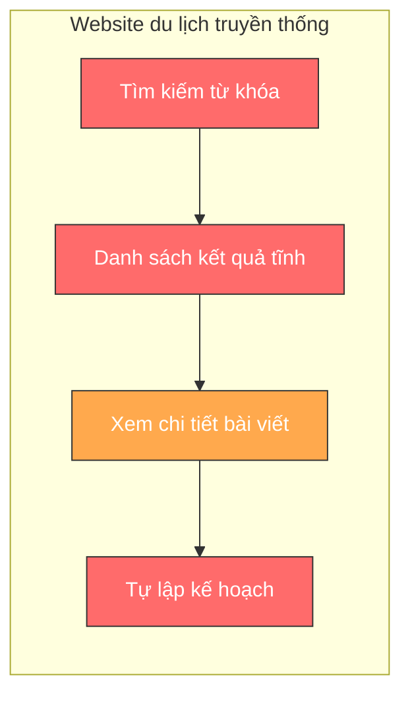

| Hạn chế | Chi tiết |
|---------|----------|
| **Tìm kiếm dựa trên từ khóa (Keyword-based)** | Chỉ tìm được kết quả khi người dùng gõ đúng tên địa điểm hoặc từ khóa chính xác. Không hiểu ý nghĩa ngữ cảnh của câu hỏi |
| **Nội dung tĩnh** | Thông tin được viết một lần và ít khi cập nhật. Không có khả năng tương tác hai chiều |
| **Không cá nhân hóa** | Mọi người dùng nhìn thấy cùng một nội dung, không phân biệt nhu cầu, ngân sách hay sở thích |
| **Không hỗ trợ lập kế hoạch** | Người dùng phải tự tổng hợp thông tin từ nhiều trang khác nhau để lập lịch trình |
| **Không ước tính chi phí** | Không có tính năng tự động tính toán tổng chi phí cho chuyến đi |
| **Không tương tác thời gian thực** | Người dùng không thể đặt câu hỏi bổ sung hay yêu cầu giải thích thêm |

### 3.4. Hạn chế của chatbot AI không sử dụng RAG

| Hạn chế | Chi tiết | Ví dụ |
|---------|----------|-------|
| **Hallucination (ảo giác)** | LLM tự tin sinh ra thông tin không có thật | _"Bãi biển Hạ Long có vé vào cửa 500.000đ"_ (thông tin sai) |
| **Không kiểm soát nguồn** | Câu trả lời không trích dẫn nguồn cụ thể, người dùng không thể xác minh | Không biết thông tin đến từ đâu, cập nhật khi nào |
| **Dữ liệu cũ** | LLM được huấn luyện trên dữ liệu có thời điểm cắt (knowledge cutoff), không cập nhật thông tin mới | Không biết các địa điểm mới mở hoặc thay đổi giá vé |
| **Không nhất quán** | Cùng một câu hỏi, LLM có thể trả lời khác nhau ở các lần khác nhau | Hỏi lại cùng câu hỏi ra kết quả mâu thuẫn |
| **Không tùy chỉnh** | Không thể kiểm soát phạm vi kiến thức của AI; AI trả lời mọi thứ kể cả ngoài lĩnh vực du lịch | Người dùng hỏi về chính trị, AI cũng trả lời |
| **Chi phí token cao** | Phải cung cấp lượng lớn prompt instruction mỗi lần để kiểm soát hành vi | Tốn chi phí API không cần thiết |

### 3.5. Giải pháp mà TravelAI mang lại

TravelAI giải quyết toàn diện các vấn đề trên bằng cách kết hợp **kiến trúc RAG** với **nền tảng dữ liệu du lịch** được quản trị chặt chẽ:

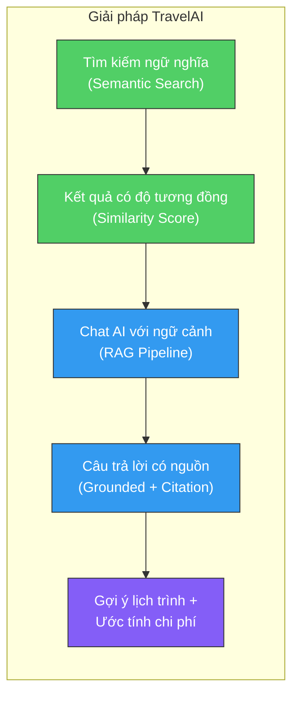

| Vấn đề | Giải pháp TravelAI |
|--------|---------------------|
| Tìm kiếm từ khóa | **Semantic Search** — Tìm kiếm dựa trên ý nghĩa ngữ cảnh bằng vector embedding |
| Hallucination | **RAG Pipeline** — AI chỉ trả lời dựa trên dữ liệu được truy xuất từ hệ thống |
| Không có nguồn | **Citation** — Mỗi câu trả lời kèm theo danh sách nguồn tham khảo (sources) với similarity score |
| Nội dung tĩnh | **Chat AI thời gian thực** — Người dùng tương tác trực tiếp, đặt câu hỏi tự nhiên |
| Không cá nhân hóa | **Lịch trình thông minh** — AI gợi ý dựa trên sở thích, thời gian và ngân sách cụ thể |
| Dữ liệu cũ | **Knowledge Base được quản trị** — Admin cập nhật dữ liệu và hệ thống tự động reindex embedding |
| Tốn thời gian | **All-in-one platform** — Tìm kiếm, xem chi tiết, hỏi AI, lập kế hoạch, ước tính chi phí tại một nơi |

---

## 4. Mục tiêu chức năng

### 4.1. Tổng quan nhóm chức năng

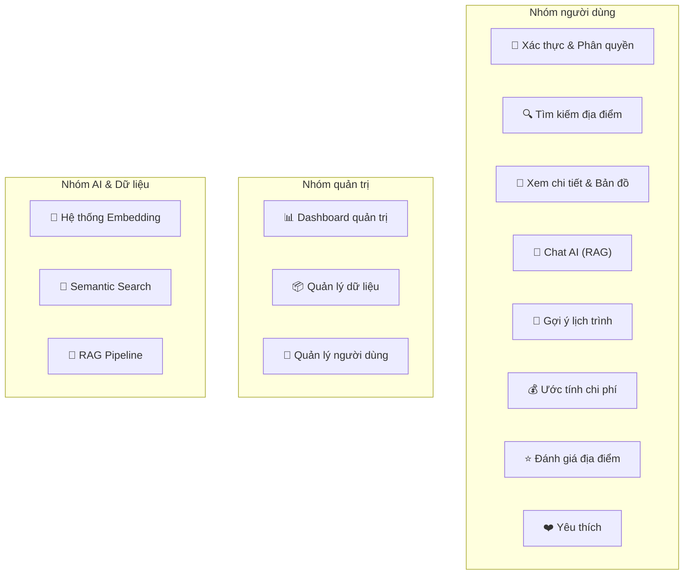

### 4.2. Chi tiết từng nhóm chức năng

#### FC-01: Đăng ký tài khoản (Registration)

| Thuộc tính | Nội dung |
|------------|----------|
| **Mục tiêu** | Cho phép khách tạo tài khoản mới để truy cập đầy đủ tính năng hệ thống |
| **Actor** | Khách (Guest) |
| **Mô tả** | Người dùng cung cấp thông tin cá nhân (họ tên, username, email, mật khẩu), hệ thống kiểm tra trùng lặp email, mã hóa mật khẩu bằng bcrypt và tạo tài khoản |
| **Đầu ra** | Tài khoản User mới được tạo trong hệ thống |

#### FC-02: Đăng nhập (Authentication)

| Thuộc tính | Nội dung |
|------------|----------|
| **Mục tiêu** | Xác thực danh tính người dùng và cấp quyền truy cập hệ thống |
| **Actor** | Người dùng (User), Quản trị viên (Admin) |
| **Mô tả** | Người dùng đăng nhập bằng username + mật khẩu. Hệ thống xác thực bằng bcrypt compare, tạo JWT token và trả về thông tin người dùng |
| **Đầu ra** | JWT Access Token, thông tin người dùng (không bao gồm password) |

#### FC-03: Quản lý người dùng (User Management)

| Thuộc tính | Nội dung |
|------------|----------|
| **Mục tiêu** | Cho phép quản trị viên và người dùng quản lý thông tin tài khoản |
| **Actor** | Admin (toàn quyền), User (chỉ tài khoản cá nhân) |
| **Mô tả** | Bao gồm: xem danh sách người dùng, xem chi tiết, cập nhật thông tin, vô hiệu hóa / xóa tài khoản. Password được loại bỏ khỏi response |
| **Đầu ra** | Thông tin người dùng được cập nhật, danh sách người dùng |

#### FC-04: Tìm kiếm địa điểm (Place Search)

| Thuộc tính | Nội dung |
|------------|----------|
| **Mục tiêu** | Cung cấp khả năng tìm kiếm địa điểm du lịch nhanh chóng và chính xác |
| **Actor** | Guest, User, Admin |
| **Mô tả** | Hỗ trợ hai loại tìm kiếm: (1) **Tìm kiếm cơ bản** — theo tên, khu vực, danh mục; (2) **Tìm kiếm ngữ nghĩa** — sử dụng Semantic Search qua vector embedding, cho phép tìm bằng câu tự nhiên |
| **Đầu ra** | Danh sách địa điểm phù hợp, kèm similarity score (cho Semantic Search) |

#### FC-05: Xem chi tiết địa điểm (Place Detail)

| Thuộc tính | Nội dung |
|------------|----------|
| **Mục tiêu** | Hiển thị đầy đủ thông tin về một địa điểm du lịch cụ thể |
| **Actor** | Guest, User, Admin |
| **Mô tả** | Hiển thị: tên, mô tả chi tiết, vị trí, khu vực (miền), thời điểm tốt nhất để đến, loại hình, giá vé vào cửa, đánh giá từ cộng đồng |
| **Đầu ra** | Trang chi tiết địa điểm với đầy đủ thông tin |

#### FC-06: Hiển thị bản đồ (Map Display)

| Thuộc tính | Nội dung |
|------------|----------|
| **Mục tiêu** | Trực quan hóa vị trí địa lý của các địa điểm du lịch trên bản đồ tương tác |
| **Actor** | Guest, User, Admin |
| **Mô tả** | Tích hợp bản đồ (Google Maps hoặc Leaflet) để hiển thị vị trí địa điểm, cho phép zoom, di chuyển và xem các địa điểm lân cận |
| **Đầu ra** | Bản đồ tương tác với marker đánh dấu vị trí |

#### FC-07: Chat AI (AI Chat with RAG)

| Thuộc tính | Nội dung |
|------------|----------|
| **Mục tiêu** | Cho phép người dùng trò chuyện với AI để được tư vấn du lịch dựa trên dữ liệu thực của hệ thống |
| **Actor** | User (bắt buộc đăng nhập) |
| **Mô tả** | Người dùng gửi câu hỏi bằng ngôn ngữ tự nhiên. Hệ thống thực hiện RAG Pipeline: (1) Embed câu hỏi → (2) Semantic Search trong pgvector → (3) Lấy Top-K documents → (4) Inject vào prompt → (5) Gọi LLM sinh câu trả lời → (6) Trả về kèm nguồn tham khảo |
| **Đầu ra** | Câu trả lời bằng tiếng Việt, danh sách nguồn tham khảo (sources) với similarity score, câu hỏi gốc |

#### FC-08: Gợi ý lịch trình du lịch (Trip Suggestion)

| Thuộc tính | Nội dung |
|------------|----------|
| **Mục tiêu** | AI tự động sinh lịch trình du lịch phù hợp với nhu cầu người dùng |
| **Actor** | User |
| **Mô tả** | Dựa trên input từ người dùng (điểm đến, số ngày, sở thích, ngân sách), hệ thống sử dụng RAG để truy xuất các địa điểm phù hợp và gọi LLM sinh lịch trình chi tiết theo ngày |
| **Đầu ra** | Lịch trình du lịch theo ngày, kèm thông tin địa điểm và gợi ý hoạt động |

#### FC-09: Ước tính chi phí (Cost Estimation)

| Thuộc tính | Nội dung |
|------------|----------|
| **Mục tiêu** | Cung cấp ước tính chi phí cho chuyến du lịch dựa trên dữ liệu thực tế |
| **Actor** | User |
| **Mô tả** | Hệ thống tổng hợp thông tin vé vào cửa (entryFee) và các chi phí liên quan từ dữ liệu địa điểm, kết hợp với AI để ước tính chi phí tổng thể (ăn uống, di chuyển, lưu trú) |
| **Đầu ra** | Bảng ước tính chi phí chi tiết cho chuyến đi |

#### FC-10: Đánh giá địa điểm (Place Review)

| Thuộc tính | Nội dung |
|------------|----------|
| **Mục tiêu** | Cho phép người dùng chia sẻ trải nghiệm và đánh giá các địa điểm đã đến |
| **Actor** | User (bắt buộc đăng nhập) |
| **Mô tả** | Người dùng có thể đánh giá (rating + nhận xét) cho từng địa điểm. Mỗi người chỉ được đánh giá một lần cho mỗi địa điểm, nhưng có thể chỉnh sửa đánh giá |
| **Đầu ra** | Đánh giá được lưu trữ và hiển thị trên trang chi tiết địa điểm |

#### FC-11: Yêu thích (Favorites)

| Thuộc tính | Nội dung |
|------------|----------|
| **Mục tiêu** | Cho phép người dùng lưu lại các địa điểm quan tâm để xem lại sau |
| **Actor** | User (bắt buộc đăng nhập) |
| **Mô tả** | Người dùng nhấn nút yêu thích để lưu/bỏ lưu địa điểm. Danh sách yêu thích được quản lý trong trang cá nhân |
| **Đầu ra** | Danh sách địa điểm yêu thích của người dùng |

#### FC-12: Dashboard quản trị (Admin Dashboard)

| Thuộc tính | Nội dung |
|------------|----------|
| **Mục tiêu** | Cung cấp giao diện tổng quan cho quản trị viên để giám sát và quản lý hệ thống |
| **Actor** | Admin |
| **Mô tả** | Hiển thị thống kê: tổng số địa điểm, số người dùng, số lượt chat AI, tỷ lệ embedding đã index. Cho phép truy cập nhanh vào các chức năng quản lý |
| **Đầu ra** | Trang Dashboard với biểu đồ và số liệu thống kê |

#### FC-13: Quản lý dữ liệu địa điểm (Place Data Management)

| Thuộc tính | Nội dung |
|------------|----------|
| **Mục tiêu** | Cho phép Admin thêm, sửa, xóa dữ liệu địa điểm du lịch trong hệ thống |
| **Actor** | Admin |
| **Mô tả** | Thao tác CRUD đầy đủ trên bảng `travelplaces`. Khi thêm mới hoặc cập nhật, hệ thống tự động gọi Embedding Service để index/reindex vector embedding tương ứng |
| **Đầu ra** | Dữ liệu địa điểm được cập nhật trong PostgreSQL và vector embedding được đồng bộ trong pgvector |

#### FC-14: Quản lý dữ liệu AI (AI Data Management)

| Thuộc tính | Nội dung |
|------------|----------|
| **Mục tiêu** | Cho phép Admin quản lý và giám sát trạng thái của cơ sở tri thức AI |
| **Actor** | Admin |
| **Mô tả** | Xem danh sách địa điểm đã/chưa được index embedding. Cho phép reindex thủ công từng địa điểm hoặc batch reindex toàn bộ |
| **Đầu ra** | Trạng thái embedding của từng địa điểm, khả năng reindex |

#### FC-15: Hệ thống Embedding (Embedding System)

| Thuộc tính | Nội dung |
|------------|----------|
| **Mục tiêu** | Chuyển đổi dữ liệu văn bản về địa điểm thành vector embedding để phục vụ Semantic Search |
| **Actor** | AI Service (nội bộ) |
| **Mô tả** | Sử dụng model `text-embedding-3-small` (OpenAI) để tạo vector 1536 chiều. Dữ liệu được concatenate từ các trường: tên, mô tả, địa điểm, khu vực, thời điểm tốt nhất, loại hình. Vector được lưu dưới dạng `vector(1536)` trong pgvector |
| **Đầu ra** | Vector embedding được lưu trong cột `embedding` của bảng `travelplaces` |

#### FC-16: Semantic Search (Tìm kiếm ngữ nghĩa)

| Thuộc tính | Nội dung |
|------------|----------|
| **Mục tiêu** | Tìm kiếm các địa điểm có nội dung tương đồng với câu hỏi của người dùng dựa trên ý nghĩa ngữ cảnh |
| **Actor** | AI Service (nội bộ), được gọi bởi User thông qua Chat AI hoặc Search |
| **Mô tả** | Câu hỏi người dùng được embed thành vector → So sánh cosine distance (`<=>`) với tất cả vector trong bảng → Trả về Top-K kết quả có similarity cao nhất |
| **Đầu ra** | Danh sách Top-K tài liệu (RetrievedDoc) kèm similarity score |

#### FC-17: RAG Pipeline

| Thuộc tính | Nội dung |
|------------|----------|
| **Mục tiêu** | Orchestrate toàn bộ quy trình từ câu hỏi người dùng đến câu trả lời AI có căn cứ |
| **Actor** | AI Service (nội bộ) |
| **Mô tả** | Quy trình: User Query → Embedding → Semantic Search → Top-K Docs → Context Injection vào System Prompt → LLM Generation → Response with Sources. Hệ thống đảm bảo AI chỉ trả lời dựa trên dữ liệu được truy xuất |
| **Đầu ra** | Câu trả lời AI có ngữ cảnh, kèm danh sách nguồn tham khảo |

---

## 5. Yêu cầu phi chức năng

### 5.1. Tổng quan

| Ký hiệu | Yêu cầu | Mức độ ưu tiên |
|----------|----------|-----------------|
| NFR-01 | Hiệu năng | 🔴 Cao |
| NFR-02 | Bảo mật | 🔴 Cao |
| NFR-03 | Khả năng mở rộng | 🟡 Trung bình |
| NFR-04 | Khả năng bảo trì | 🟡 Trung bình |
| NFR-05 | Độ sẵn sàng | 🟡 Trung bình |
| NFR-06 | Tốc độ phản hồi | 🔴 Cao |
| NFR-07 | Khả năng chịu tải | 🟡 Trung bình |
| NFR-08 | Chất lượng câu trả lời AI | 🔴 Cao |

### 5.2. Chi tiết

#### NFR-01: Hiệu năng (Performance)

| Tiêu chí | Yêu cầu |
|----------|----------|
| Thời gian tải trang | ≤ 2 giây cho các trang thông thường (danh sách, chi tiết) |
| Thời gian tìm kiếm cơ bản | ≤ 500ms cho full-text search |
| Thời gian Semantic Search | ≤ 1.5 giây (bao gồm embedding + vector search) |
| Thời gian sinh câu trả lời AI | ≤ 10 giây cho toàn bộ RAG Pipeline (embedding + search + generation) |
| Database query | ≤ 200ms cho các truy vấn CRUD thông thường |

#### NFR-02: Bảo mật (Security)

| Tiêu chí | Yêu cầu |
|----------|----------|
| Mã hóa mật khẩu | Sử dụng bcrypt với salt rounds ≥ 10 |
| Xác thực | JWT (JSON Web Token) với expiration time hợp lý |
| Phân quyền | Role-based Access Control (RBAC): Guest, User, Admin |
| API bảo vệ | Tất cả API nhạy cảm đều được bảo vệ bằng JWT Guard |
| CORS | Cấu hình CORS phù hợp với domain cho phép |
| Dữ liệu nhạy cảm | Password không bao giờ được trả về trong response (đã implement: `select: false`, destructuring) |
| API Key | OpenAI API Key được lưu trong biến môi trường, không hardcode |
| SQL Injection | Sử dụng parameterized queries cho raw SQL (pgvector operations) |

#### NFR-03: Khả năng mở rộng (Scalability)

| Tiêu chí | Yêu cầu |
|----------|----------|
| Kiến trúc module | NestJS Module System cho phép thêm/bớt tính năng độc lập |
| Database | PostgreSQL với pgvector hỗ trợ indexing cho vector search khi dữ liệu lớn (IVFFlat, HNSW) |
| Caching | Redis sẵn sàng cho caching và session management |
| Queue | BullMQ sẵn sàng cho xử lý batch embedding và các tác vụ nặng |
| Container | Docker & Docker Compose cho phép scale horizontal khi cần |

#### NFR-04: Khả năng bảo trì (Maintainability)

| Tiêu chí | Yêu cầu |
|----------|----------|
| Cấu trúc code | NestJS Module Pattern: mỗi module có Controller, Service, DTO, Entity riêng biệt |
| TypeScript | Strict typing giúp phát hiện lỗi sớm |
| Code style | ESLint + Prettier đảm bảo code style nhất quán |
| Configuration | Tách riêng config qua biến môi trường (.env) và ConfigService |
| Versioning | API versioning (URI-based, default v1) cho backward compatibility |
| Logging | NestJS Logger tích hợp cho monitoring và debugging |

#### NFR-05: Độ sẵn sàng (Availability)

| Tiêu chí | Yêu cầu |
|----------|----------|
| Uptime mục tiêu | ≥ 99% trong giờ hoạt động |
| Database | PostgreSQL volume được persist qua Docker volume |
| Container restart | Docker container có `restart: always` policy |
| Graceful degradation | Khi AI service không khả dụng, hệ thống vẫn hoạt động bình thường cho các chức năng không AI |

#### NFR-06: Tốc độ phản hồi (Response Time)

| Tiêu chí | Yêu cầu |
|----------|----------|
| API CRUD | ≤ 300ms (P95) |
| Semantic Search | ≤ 2 giây (P95) |
| Chat AI (full pipeline) | ≤ 12 giây (P95) — bao gồm network latency đến OpenAI |
| Streaming Response (tương lai) | First token ≤ 2 giây, sau đó stream liên tục |

#### NFR-07: Khả năng chịu tải (Load Capacity)

| Tiêu chí | Yêu cầu |
|----------|----------|
| Concurrent users | Hỗ trợ ≥ 100 người dùng đồng thời cho các chức năng thông thường |
| AI concurrent | Hỗ trợ ≥ 10 request AI đồng thời (giới hạn bởi OpenAI rate limit) |
| Database connections | Connection pool quản lý bởi TypeORM |
| Queue processing | BullMQ xử lý background jobs không ảnh hưởng đến main thread |

#### NFR-08: Chất lượng câu trả lời AI (AI Response Quality)

| Tiêu chí | Yêu cầu |
|----------|----------|
| Groundedness | AI chỉ trả lời dựa trên dữ liệu từ Vector Database, không tự do sáng tạo |
| Citation | Mỗi câu trả lời phải kèm danh sách nguồn tham khảo (sources) |
| Hallucination prevention | System prompt yêu cầu AI nói thật khi không đủ thông tin, không bịa đặt |
| Ngôn ngữ | Trả lời bằng tiếng Việt tự nhiên, thân thiện |
| Độ dài phù hợp | Câu trả lời vừa đủ, không quá ngắn (vô ích) hay quá dài (loãng) |
| Temperature | Sử dụng temperature = 0.7 (cân bằng giữa sáng tạo và chính xác) |
| Top-K | Mặc định lấy 3 tài liệu liên quan nhất (có thể tùy chỉnh) |

---

## 6. Quy tắc nghiệp vụ

### 6.1. Quy tắc xác thực và phân quyền

| Mã | Quy tắc | Chi tiết |
|----|---------|----------|
| BR-01 | **Email duy nhất** | Hệ thống không cho phép hai tài khoản có cùng địa chỉ email. Kiểm tra trùng lặp trước khi tạo tài khoản |
| BR-02 | **Mật khẩu phải được mã hóa** | Mật khẩu luôn được hash bằng bcrypt trước khi lưu vào database. Không bao giờ lưu plain text |
| BR-03 | **Mật khẩu không được trả về** | Mọi API response chứa thông tin người dùng phải loại bỏ trường password |
| BR-04 | **Xác thực bằng JWT** | Tất cả API yêu cầu xác thực phải kiểm tra JWT token hợp lệ |
| BR-05 | **Phân quyền theo vai trò** | Guest: chỉ xem; User: xem + tương tác; Admin: toàn quyền |

### 6.2. Quy tắc người dùng

| Mã | Quy tắc | Chi tiết |
|----|---------|----------|
| BR-06 | **Chỉ User đã đăng nhập mới được chat AI** | Guest không có quyền truy cập endpoint `/rag/chat` |
| BR-07 | **Chỉ User đã đăng nhập mới được đánh giá** | Đánh giá địa điểm yêu cầu authentication |
| BR-08 | **Mỗi User chỉ đánh giá một lần cho mỗi địa điểm** | Nếu đã đánh giá, User chỉ có thể chỉnh sửa đánh giá cũ, không thể tạo đánh giá mới |
| BR-09 | **Chỉ User đã đăng nhập mới được lưu yêu thích** | Tính năng yêu thích yêu cầu authentication |

### 6.3. Quy tắc quản trị

| Mã | Quy tắc | Chi tiết |
|----|---------|----------|
| BR-10 | **Chỉ Admin được CRUD địa điểm** | Người dùng thông thường không có quyền thêm, sửa, xóa dữ liệu địa điểm |
| BR-11 | **Chỉ Admin được quản lý người dùng** | Bao gồm xem danh sách, vô hiệu hóa, xóa tài khoản |
| BR-12 | **Chỉ Admin được index/reindex embedding** | Thao tác thủ công trên endpoint `/rag/index` và `/rag/reindex/:id` |

### 6.4. Quy tắc AI

| Mã | Quy tắc | Chi tiết |
|----|---------|----------|
| BR-13 | **AI chỉ trả lời dựa trên dữ liệu hệ thống** | System prompt yêu cầu: _"Chỉ sử dụng thông tin trong phần THÔNG TIN THAM KHẢO"_ |
| BR-14 | **Không sinh thông tin nếu không có dữ liệu** | Khi không đủ thông tin, AI phải nói thật và đưa ra gợi ý chung, không bịa đặt |
| BR-15 | **Câu trả lời bằng tiếng Việt** | AI luôn phản hồi bằng tiếng Việt, tự nhiên như người bản địa |
| BR-16 | **Câu trả lời phải kèm nguồn** | Response luôn bao gồm mảng `sources` chứa danh sách RetrievedDoc |
| BR-17 | **Giới hạn độ dài câu trả lời** | `max_tokens = 800` để đảm bảo câu trả lời vừa đủ |

### 6.5. Quy tắc dữ liệu

| Mã | Quy tắc | Chi tiết |
|----|---------|----------|
| BR-18 | **Khi tạo địa điểm mới, tự động tạo embedding** | Endpoint `/rag/index` tự động embed và lưu vector vào cùng record |
| BR-19 | **Khi cập nhật địa điểm, phải reindex embedding** | Gọi `/rag/reindex/:id` để cập nhật vector embedding phản ánh nội dung mới |
| BR-20 | **Embedding dimension cố định 1536** | Khớp với model `text-embedding-3-small` và kiểu `vector(1536)` trong database |
| BR-21 | **Dữ liệu embed từ nhiều trường** | Concatenate: tên + mô tả + địa điểm + khu vực + thời điểm tốt nhất + loại hình |
| BR-22 | **Chỉ tìm kiếm trên record có embedding** | Query `WHERE embedding IS NOT NULL` đảm bảo chỉ search trên dữ liệu đã index |

---

## 7. Luồng hoạt động tổng quát

### 7.1. Luồng trải nghiệm người dùng

Dưới đây mô tả luồng trải nghiệm chính của một người dùng từ khi truy cập hệ thống đến khi hoàn thành kế hoạch du lịch:

**Bước 1 — Khám phá:** Người dùng truy cập website, duyệt danh sách các địa điểm du lịch nổi bật. Có thể tìm kiếm theo tên, khu vực hoặc danh mục.

**Bước 2 — Tìm hiểu:** Khi quan tâm đến một địa điểm, người dùng nhấn vào để xem thông tin chi tiết bao gồm mô tả, vị trí trên bản đồ, giá vé, thời điểm tốt nhất và đánh giá từ cộng đồng.

**Bước 3 — Tương tác AI:** Người dùng đặt câu hỏi cho AI bằng ngôn ngữ tự nhiên. AI truy xuất dữ liệu liên quan và sinh câu trả lời có căn cứ, kèm nguồn tham khảo.

**Bước 4 — Lập kế hoạch:** Dựa trên gợi ý của AI, người dùng yêu cầu sinh lịch trình du lịch chi tiết với ước tính chi phí.

**Bước 5 — Lưu trữ:** Người dùng lưu các địa điểm yêu thích và đánh giá các địa điểm đã đến.

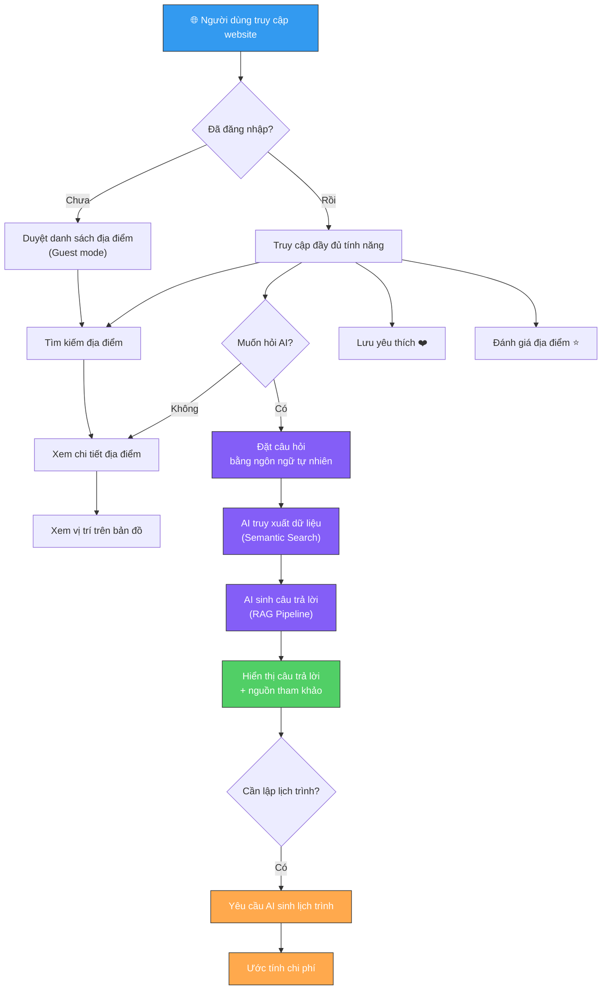

### 7.2. Luồng quản trị viên

Quản trị viên thực hiện các tác vụ quản lý dữ liệu và giám sát hệ thống:

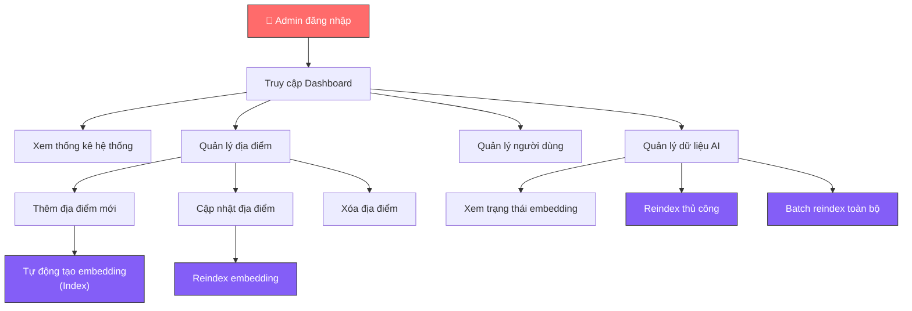

---

## 8. Luồng AI

### 8.1. Tổng quan quy trình AI

Hệ thống AI của TravelAI hoạt động theo mô hình **RAG (Retrieval-Augmented Generation)**, bao gồm hai pha chính:

1. **Pha Indexing (Offline):** Xảy ra khi Admin thêm hoặc cập nhật dữ liệu địa điểm. Dữ liệu văn bản được chuyển đổi thành vector embedding và lưu vào database.

2. **Pha Querying (Online):** Xảy ra khi người dùng gửi câu hỏi. Hệ thống tìm kiếm tài liệu liên quan và sinh câu trả lời.

### 8.2. Pha Indexing (Đưa dữ liệu vào hệ thống)

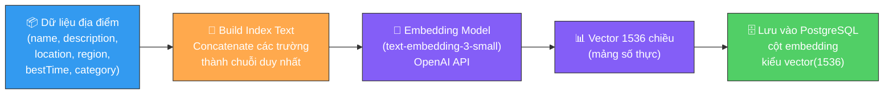

**Chi tiết các bước:**

| Bước | Tên | Mô tả | Ví dụ |
|------|-----|-------|-------|
| 1 | **Thu thập dữ liệu** | Admin nhập thông tin địa điểm qua API `/rag/index` hoặc `/travelplaces` | `{ name: "Hội An", description: "Phố cổ xinh đẹp...", location: "Quảng Nam", ... }` |
| 2 | **Build Index Text** | Concatenate các trường quan trọng thành chuỗi duy nhất | `"Tên: Hội An. Mô tả: Phố cổ xinh đẹp... Địa điểm: Quảng Nam. Khu vực: Miền Trung"` |
| 3 | **Embedding** | Gọi OpenAI API để chuyển chuỗi text thành vector 1536 chiều | `[0.0231, -0.0142, 0.0089, ...]` (1536 số) |
| 4 | **Lưu trữ** | Lưu vector vào cột `embedding` với kiểu `vector(1536)` trong PostgreSQL/pgvector | `INSERT INTO travelplaces (..., embedding) VALUES (..., $1::vector)` |

### 8.3. Pha Querying (Trả lời câu hỏi)

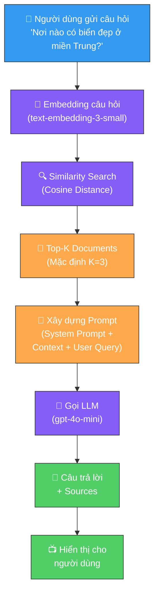

**Chi tiết các bước:**

| Bước | Tên | Mô tả | Thời gian ước tính |
|------|-----|-------|---------------------|
| 1 | **Nhận câu hỏi** | User gửi message qua API `POST /rag/chat` | — |
| 2 | **Embedding câu hỏi** | Chuyển đổi câu hỏi thành vector 1536 chiều bằng cùng model embedding | ~300ms |
| 3 | **Similarity Search** | Truy vấn pgvector: `ORDER BY embedding <=> query_vector LIMIT topK` | ~100ms |
| 4 | **Lấy Top-K Documents** | Trả về K tài liệu có cosine similarity cao nhất | — |
| 5 | **Xây dựng Prompt** | Ghép System Prompt + Context Block (từ Top-K docs) + User Query | — |
| 6 | **Gọi LLM** | Gửi prompt đến `gpt-4o-mini` với `temperature=0.7`, `max_tokens=800` | ~3-8s |
| 7 | **Trả về Response** | Trả về `{ answer, sources, query }` cho client | — |

### 8.4. Streaming Response (Kế hoạch)

Trong phiên bản nâng cao, hệ thống sẽ sử dụng **Server-Sent Events (SSE)** để stream câu trả lời từ LLM theo thời gian thực:

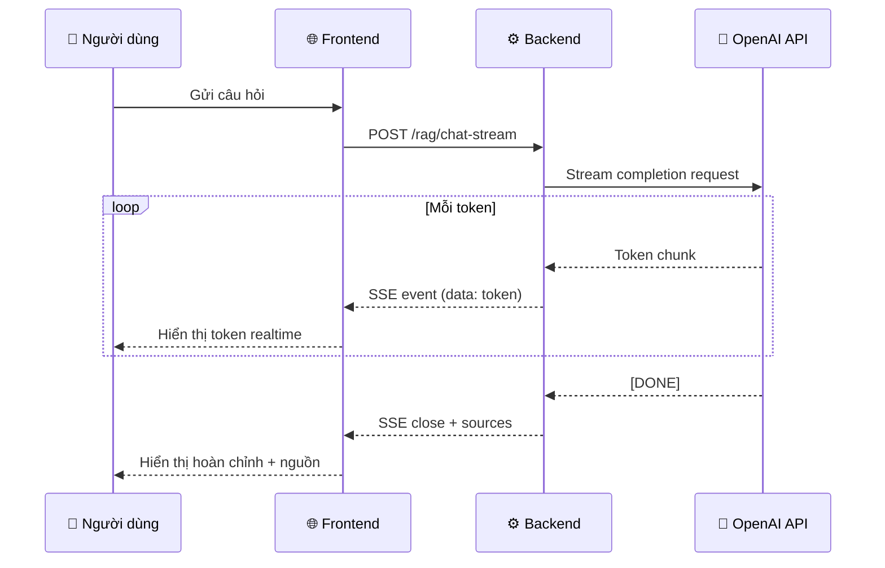

---

## 9. Luồng RAG

### 9.1. Tổng quan kiến trúc RAG

RAG (Retrieval-Augmented Generation) là kiến trúc kết hợp giữa **truy xuất thông tin (Retrieval)** và **sinh văn bản (Generation)** nhằm đảm bảo câu trả lời của LLM có căn cứ từ dữ liệu thực tế.

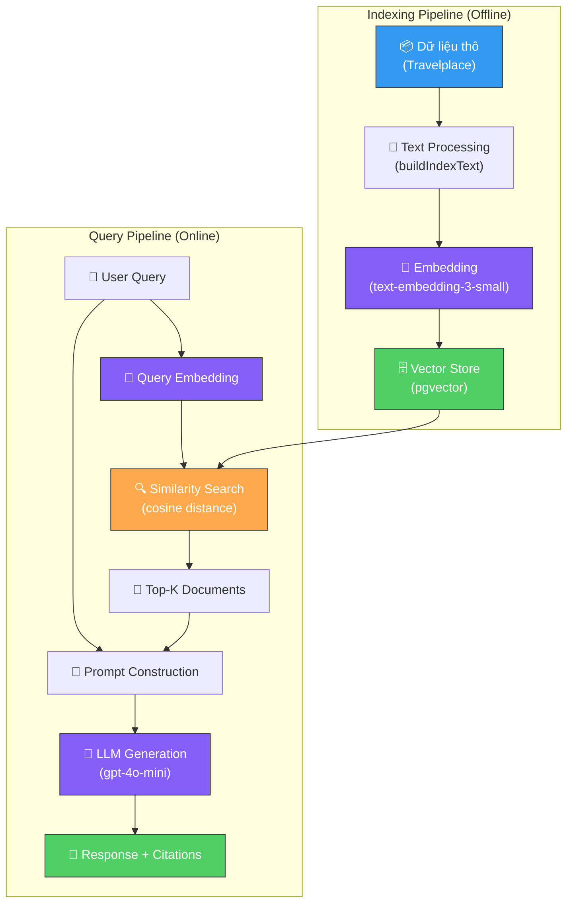

### 9.2. Embedding

**Embedding** là quá trình chuyển đổi văn bản thành vector số (vector of floating-point numbers), nơi mà các văn bản có ý nghĩa tương đồng sẽ có vector gần nhau trong không gian đa chiều.

| Thuộc tính | Giá trị trong hệ thống |
|------------|------------------------|
| **Model** | `text-embedding-3-small` (OpenAI) |
| **Dimension** | 1536 chiều |
| **Input** | Chuỗi text được concatenate từ các trường của Travelplace |
| **Output** | Mảng 1536 số thực (number[]) |
| **Tiền xử lý** | Thay thế newline bằng space (`text.replace(/\\n/g, ' ')`) |

**Cách build Index Text:**

```
"Tên: {name}. Mô tả: {description}. Địa điểm: {location}. Khu vực: {region}. Thời điểm tốt nhất để đến: {bestTime}. Loại hình: {category}"
```

Các trường `null` hoặc `undefined` sẽ bị loại bỏ (`.filter(Boolean)`), đảm bảo text index chỉ chứa thông tin có nghĩa.

### 9.3. Semantic Search

**Semantic Search** (Tìm kiếm ngữ nghĩa) sử dụng vector embedding để tìm các tài liệu có ý nghĩa tương đồng với câu hỏi, thay vì so khớp từ khóa.

**So sánh với Keyword Search:**

| Tiêu chí | Keyword Search | Semantic Search (TravelAI) |
|----------|---------------|---------------------------|
| Cơ chế | So khớp chuỗi ký tự | So sánh vector trong không gian đa chiều |
| Ví dụ query | _"bãi biển Đà Nẵng"_ | _"nơi nào có biển đẹp ở miền Trung?"_ |
| Hiểu ngữ cảnh | ❌ Không | ✅ Có |
| Đồng nghĩa | ❌ Không nhận diện | ✅ Nhận diện (biển ≈ bãi biển ≈ beach) |
| Kỹ thuật | LIKE, Full-text Search | Cosine Distance (`<=>`) trên pgvector |

**Thuật toán Similarity Search trong hệ thống:**

1. Embed câu hỏi người dùng thành vector query (`queryEmbedding`)
2. Tính **cosine distance** giữa `queryEmbedding` và mọi vector trong bảng `travelplaces`
3. Sắp xếp theo khoảng cách tăng dần (distance nhỏ = similarity cao)
4. Lấy **Top-K** kết quả (mặc định K = 3)
5. Tính **similarity score** = `1 - cosine_distance`

**SQL Query thực tế:**

```sql
SELECT id, name, description, location, region, "bestTime", category,
       1 - (embedding <=> $1::vector) AS similarity
FROM travelplaces
WHERE embedding IS NOT NULL
ORDER BY embedding <=> $1::vector
LIMIT $2
```

### 9.4. Prompt Construction (Xây dựng Prompt)

Prompt được xây dựng theo cấu trúc 3 phần:

| Phần | Vai trò | Nội dung |
|------|---------|----------|
| **System Prompt** | Định nghĩa vai trò và nguyên tắc cho AI | Bạn là trợ lý du lịch Việt Nam thông minh và thân thiện... |
| **Context Block** | Cung cấp dữ liệu tham khảo từ Top-K documents | `[Nguồn 1] Hội An - Địa điểm: Quảng Nam...` |
| **User Query** | Câu hỏi gốc của người dùng | _"Nơi nào có biển đẹp ở miền Trung?"_ |

**Cấu trúc System Prompt:**

```
Bạn là trợ lý du lịch Việt Nam thông minh và thân thiện.

NHIỆM VỤ:
Dựa vào thông tin dưới đây để trả lời câu hỏi của khách du lịch 
một cách chính xác, tự nhiên và hữu ích.

THÔNG TIN THAM KHẢO:
[Nguồn 1] {name}
  - Địa điểm: {location}
  - Khu vực: {region}
  - Thời điểm tốt nhất: {bestTime}
  - Loại hình: {category}
  - Mô tả: {description}

[Nguồn 2] ...

NGUYÊN TẮC TRẢ LỜI:
- Chỉ sử dụng thông tin trong phần "THÔNG TIN THAM KHẢO" ở trên
- Nếu không đủ thông tin, hãy nói thật và đưa ra gợi ý chung
- Trả lời bằng tiếng Việt, tự nhiên như người bản địa
- Có thể gợi ý thêm mẹo du lịch thực tế nếu phù hợp
- Độ dài câu trả lời: vừa đủ, không quá ngắn hay quá dài
```

### 9.5. Context Injection (Tiêm ngữ cảnh)

Context Injection là quá trình đưa dữ liệu truy xuất được vào prompt của LLM. Trong TravelAI:

1. **Retrieve:** Lấy Top-K documents từ Semantic Search
2. **Format:** Định dạng mỗi document thành block text có cấu trúc với nhãn `[Nguồn N]`
3. **Inject:** Ghép vào phần `THÔNG TIN THAM KHẢO` trong System Prompt
4. **Send:** Gửi toàn bộ prompt (System + Context + User Query) đến LLM

**Xử lý trường hợp đặc biệt:**

| Trường hợp | Xử lý |
|------------|-------|
| Knowledge base rỗng (docs.length === 0) | AI vẫn trả lời nhưng đánh dấu: _"Answered without context"_ |
| Document thiếu trường | Hiển thị _"Không rõ"_ hoặc _"Quanh năm"_ thay cho null |
| Embedding lỗi | Throw error, trả về `EC: 1` với thông báo lỗi |

### 9.6. Hallucination Prevention (Ngăn chặn ảo giác)

TravelAI sử dụng nhiều lớp bảo vệ để giảm thiểu hallucination:

| Lớp | Kỹ thuật | Mô tả |
|-----|----------|-------|
| **Lớp 1: Dữ liệu** | Chỉ index dữ liệu đã xác minh | Admin kiểm tra và xác nhận thông tin trước khi đưa vào knowledge base |
| **Lớp 2: Retrieval** | Top-K filtering | Chỉ lấy K tài liệu liên quan nhất, giới hạn phạm vi thông tin AI có thể sử dụng |
| **Lớp 3: Prompt** | System prompt instruction | Yêu cầu AI _"Chỉ sử dụng thông tin trong phần THÔNG TIN THAM KHẢO"_ |
| **Lớp 4: Honesty** | Thành thật khi thiếu thông tin | _"Nếu không đủ thông tin, hãy nói thật và đưa ra gợi ý chung"_ |
| **Lớp 5: Parameter** | Temperature = 0.7 | Cân bằng giữa sáng tạo (cho câu trả lời tự nhiên) và chính xác (không bịa đặt) |
| **Lớp 6: Length** | max_tokens = 800 | Giới hạn độ dài, giảm khả năng AI lan man và thêm thông tin không có căn cứ |

### 9.7. Citation (Trích dẫn nguồn)

Mỗi câu trả lời AI đều kèm theo danh sách nguồn tham khảo, cho phép người dùng xác minh thông tin:

**Cấu trúc Response:**

```json
{
  "EC": 0,
  "EM": "Success",
  "data": {
    "answer": "Ở miền Trung, bạn nên ghé thăm...",
    "sources": [
      {
        "id": "uuid-1",
        "name": "Bãi biển Mỹ Khê",
        "description": "Bãi biển đẹp nhất hành tinh...",
        "location": "Đà Nẵng",
        "region": "Miền Trung",
        "bestTime": "Tháng 5 - 8",
        "category": "beach",
        "similarity": 0.89
      },
      ...
    ],
    "query": "Nơi nào có biển đẹp ở miền Trung?"
  }
}
```

| Trường | Ý nghĩa |
|--------|---------|
| `sources[].name` | Tên địa điểm được tham khảo |
| `sources[].similarity` | Điểm tương đồng (0-1), càng cao càng liên quan |
| `query` | Câu hỏi gốc của người dùng |

---

## 10. Kiến trúc tổng quan

### 10.1. Sơ đồ kiến trúc mức cao

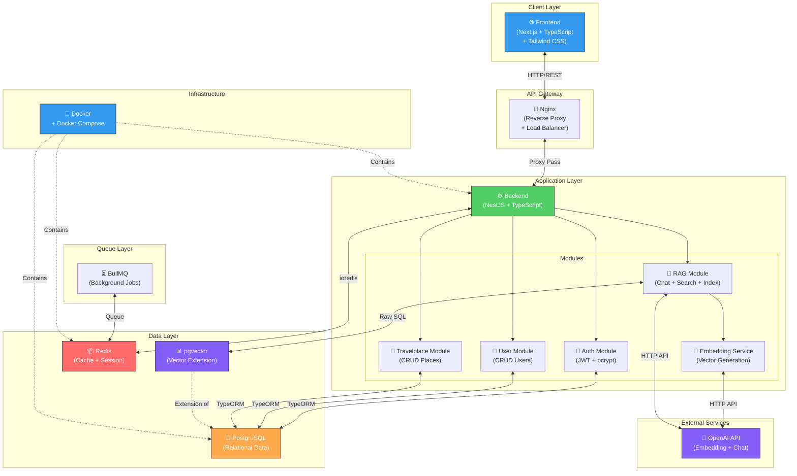

### 10.2. Mô tả các thành phần

| Thành phần | Công nghệ | Vai trò | Port |
|------------|-----------|---------|------|
| **Frontend** | Next.js, TypeScript, Tailwind CSS | Giao diện người dùng (SPA/SSR), hiển thị dữ liệu, tương tác với Backend qua REST API | 3000 |
| **Backend** | NestJS, TypeScript | API server, xử lý logic nghiệp vụ, xác thực, phân quyền, orchestrate RAG pipeline | 8080 |
| **PostgreSQL** | PostgreSQL + pgvector extension | Lưu trữ dữ liệu quan hệ (users, travelplaces) và vector embedding. Image: `ankane/pgvector` | 5433→5432 |
| **pgvector** | PostgreSQL extension | Cung cấp kiểu dữ liệu `vector(N)`, các phép tính distance (cosine, L2, inner product) và indexing cho vector search | (tích hợp trong PostgreSQL) |
| **Redis** | Redis 7 | Caching, session storage, message broker cho BullMQ | 6379 |
| **BullMQ** | BullMQ (Node.js) | Xử lý background jobs: batch embedding, reindex hàng loạt, các tác vụ nặng không cần response tức thì | (sử dụng Redis) |
| **OpenAI API** | OpenAI REST API | Cung cấp Embedding Model (`text-embedding-3-small`) và Chat Model (`gpt-4o-mini`) | (external) |
| **Nginx** | Nginx | Reverse proxy, load balancing, SSL termination, serve static files | 80/443 |
| **Docker** | Docker + Docker Compose | Container hóa toàn bộ hệ thống, đảm bảo môi trường nhất quán giữa dev/staging/production | — |

### 10.3. Cấu trúc Module Backend

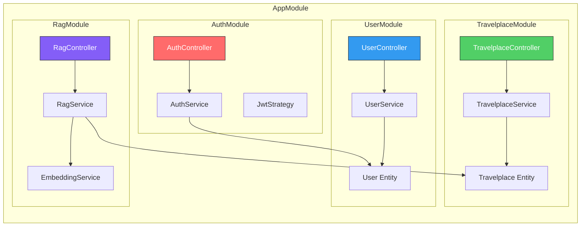

---

## 11. Luồng dữ liệu

### 11.1. Luồng dữ liệu tổng quan

Dữ liệu trong hệ thống TravelAI di chuyển giữa các thành phần theo các luồng chính sau:

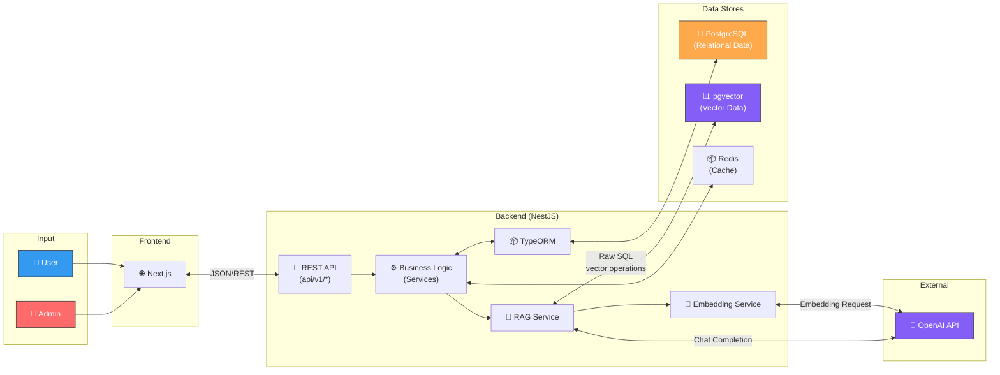

### 11.2. Luồng dữ liệu chi tiết theo chức năng

#### Luồng 1: Đăng ký & Đăng nhập

```
User → Frontend → POST /api/v1/auth/register → AuthService.createUser()
  → Kiểm tra email trùng (UserRepo.findOneBy)
  → Hash password (bcrypt)
  → Lưu vào PostgreSQL (UserRepo.save)
  → Trả về user info (không có password)
```

#### Luồng 2: CRUD Địa điểm

```
Admin → Frontend → POST /api/v1/travelplaces → TravelplaceService.create()
  → Tạo entity (travelplaceRepo.create)
  → Lưu vào PostgreSQL (travelplaceRepo.save)
  → [Tùy chọn] Gọi RagService.indexPlace() để tạo embedding
  → Trả về thông tin địa điểm
```

#### Luồng 3: Index Embedding

```
Admin → Frontend → POST /api/v1/rag/index → RagService.indexPlace()
  → EmbeddingService.buildIndexText(dto)       ← Concatenate text
  → EmbeddingService.embed(text)                ← Gọi OpenAI API
  → EmbeddingService.toVectorString(embedding)  ← Format vector
  → DataSource.query(INSERT ... $1::vector)     ← Lưu vào pgvector
  → Trả về { id, name, location }
```

#### Luồng 4: Chat AI (RAG Pipeline)

```
User → Frontend → POST /api/v1/rag/chat → RagService.chat()
  → RagService.retrieve(message, topK)
    → EmbeddingService.embed(query)             ← Embed câu hỏi
    → DataSource.query(SELECT ... ORDER BY <=>)  ← Similarity Search
    → Return Top-K RetrievedDoc[]
  → RagService.generate(query, docs)
    → Xây dựng contextBlock từ docs
    → Xây dựng systemPrompt với context
    → openai.chat.completions.create(...)        ← Gọi LLM
    → Return answer string
  → Trả về { answer, sources, query }
```

#### Luồng 5: Semantic Search (Standalone)

```
User → Frontend → GET /api/v1/rag/retrieve?q=...&topK=3
  → RagService.retrieve(query, topK)
    → EmbeddingService.embed(query)
    → DataSource.query(cosine similarity search)
    → Return RetrievedDoc[] với similarity scores
```

### 11.3. Bảng tổng hợp API Endpoints

| Method | Endpoint | Module | Mô tả | Auth |
|--------|----------|--------|-------|------|
| POST | `/api/v1/auth/register` | Auth | Đăng ký tài khoản | ❌ |
| POST | `/api/v1/auth/login` | Auth | Đăng nhập | ❌ |
| GET | `/api/v1/users` | User | Lấy danh sách người dùng | 🔐 Admin |
| GET | `/api/v1/users/:id` | User | Lấy chi tiết người dùng | 🔐 |
| PATCH | `/api/v1/users/:id` | User | Cập nhật người dùng | 🔐 |
| DELETE | `/api/v1/users/:id` | User | Xóa người dùng | 🔐 Admin |
| GET | `/api/v1/travelplaces` | Travelplace | Lấy danh sách địa điểm | ❌ |
| GET | `/api/v1/travelplaces/:id` | Travelplace | Lấy chi tiết địa điểm | ❌ |
| POST | `/api/v1/travelplaces` | Travelplace | Thêm địa điểm | 🔐 Admin |
| PATCH | `/api/v1/travelplaces/:id` | Travelplace | Cập nhật địa điểm | 🔐 Admin |
| DELETE | `/api/v1/travelplaces/:id` | Travelplace | Xóa địa điểm | 🔐 Admin |
| POST | `/api/v1/rag/chat` | RAG | Chat AI (RAG pipeline) | 🔐 |
| POST | `/api/v1/rag/index` | RAG | Index địa điểm mới | 🔐 Admin |
| GET | `/api/v1/rag/retrieve` | RAG | Semantic Search | ❌ |
| POST | `/api/v1/rag/reindex/:id` | RAG | Reindex embedding | 🔐 Admin |

---

## 12. Các giả định và ràng buộc

### 12.1. Giả định (Assumptions)

| STT | Giả định | Giải thích |
|-----|----------|------------|
| 1 | **Người dùng có kết nối Internet ổn định** | Hệ thống là web application, yêu cầu kết nối Internet để truy cập. Đặc biệt, tính năng AI phụ thuộc vào OpenAI API |
| 2 | **Dữ liệu địa điểm được nhập chính xác bởi Admin** | Chất lượng câu trả lời AI phụ thuộc trực tiếp vào chất lượng dữ liệu trong knowledge base |
| 3 | **OpenAI API luôn khả dụng** | Hệ thống phụ thuộc vào OpenAI cho cả Embedding và Chat Completion. Nếu API gặp sự cố, tính năng AI sẽ không hoạt động |
| 4 | **Số lượng địa điểm ở mức vừa phải** | Phiên bản đầu tập trung vào du lịch Việt Nam với hàng trăm đến hàng nghìn địa điểm. Chưa tối ưu cho hàng triệu records |
| 5 | **Người dùng chủ yếu sử dụng tiếng Việt** | AI được cấu hình trả lời bằng tiếng Việt, embedding model hỗ trợ đa ngôn ngữ nhưng tối ưu cho tiếng Việt |
| 6 | **Trình duyệt hiện đại** | Frontend sử dụng Next.js và các tính năng JavaScript hiện đại, yêu cầu trình duyệt cập nhật |

### 12.2. Ràng buộc (Constraints)

| STT | Ràng buộc | Loại | Chi tiết |
|-----|-----------|------|----------|
| 1 | **Chưa tích hợp cổng thanh toán** | Nghiệp vụ | Hệ thống chỉ ước tính chi phí, không xử lý giao dịch tài chính |
| 2 | **Chưa tích hợp API đặt phòng khách sạn** | Nghiệp vụ | Không liên kết với các OTA (Booking.com, Agoda, Traveloka) |
| 3 | **Chưa tích hợp API vé máy bay / tàu xe** | Nghiệp vụ | Không cung cấp dịch vụ đặt vé giao thông |
| 4 | **AI chỉ hoạt động khi có Internet** | Kỹ thuật | Phụ thuộc vào OpenAI API (external service) |
| 5 | **Giới hạn bởi OpenAI rate limit** | Kỹ thuật | Số lượng request đồng thời đến OpenAI bị giới hạn bởi plan API |
| 6 | **Chi phí API OpenAI** | Tài chính | Mỗi lần embed và chat đều tốn token, cần quản lý budget |
| 7 | **pgvector chưa có index (HNSW/IVFFlat)** | Kỹ thuật | Phiên bản hiện tại sử dụng brute-force search, cần thêm index khi dữ liệu lớn |
| 8 | **Chưa có lịch sử hội thoại** | Nghiệp vụ | Mỗi câu hỏi được xử lý độc lập, chưa có memory/conversation context |
| 9 | **Chỉ hỗ trợ tiếng Việt** | Nghiệp vụ | Phiên bản đầu chưa hỗ trợ đa ngôn ngữ |
| 10 | **Chưa có chunking chiến lược** | Kỹ thuật | Mỗi địa điểm là một document duy nhất, chưa chia nhỏ cho dữ liệu dài |

### 12.3. Rủi ro đã nhận diện

| Rủi ro | Mức độ | Giải pháp giảm thiểu |
|--------|--------|----------------------|
| OpenAI API downtime | 🟡 Trung bình | Graceful degradation — hệ thống vẫn hoạt động cho tính năng không AI |
| Chi phí API vượt budget | 🔴 Cao | Monitoring token usage, caching kết quả phổ biến trong Redis |
| Dữ liệu kém chất lượng | 🔴 Cao | Quy trình review dữ liệu trước khi index; Admin validation |
| Vector search chậm khi dữ liệu lớn | 🟡 Trung bình | Thêm HNSW index cho pgvector khi cần |
| Hallucination dù đã dùng RAG | 🟡 Trung bình | Giảm temperature, cải thiện prompt, thêm guardrails |

---

## 13. Hướng phát triển

### 13.1. Lộ trình phát triển (Roadmap)

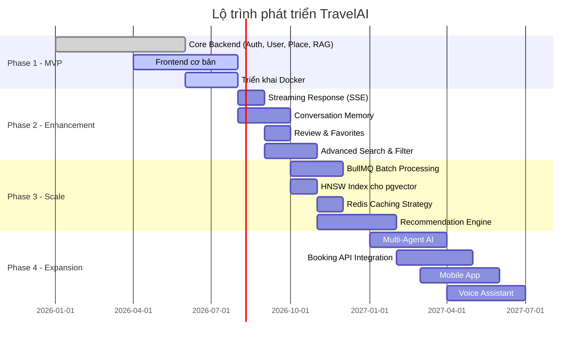

### 13.2. Chi tiết các hướng phát triển

#### 13.2.1. Streaming Response (SSE)

| Thuộc tính | Nội dung |
|------------|----------|
| **Mô tả** | Sử dụng Server-Sent Events để stream câu trả lời AI theo thời gian thực, giúp người dùng thấy câu trả lời xuất hiện dần dần thay vì chờ toàn bộ |
| **Lợi ích** | Cải thiện UX đáng kể, giảm perceived latency, tạo cảm giác AI đang "suy nghĩ" |
| **Kỹ thuật** | OpenAI streaming API + NestJS SSE controller + EventSource trên Frontend |

#### 13.2.2. Conversation Memory

| Thuộc tính | Nội dung |
|------------|----------|
| **Mô tả** | Lưu trữ lịch sử hội thoại để AI hiểu ngữ cảnh cuộc trò chuyện, cho phép câu hỏi tiếp nối |
| **Lợi ích** | Người dùng không cần lặp lại thông tin, AI hiểu ngữ cảnh tốt hơn |
| **Kỹ thuật** | Lưu conversation history trong Redis/PostgreSQL, inject vào prompt |

#### 13.2.3. Voice Assistant

| Thuộc tính | Nội dung |
|------------|----------|
| **Mô tả** | Hỗ trợ người dùng tương tác với AI bằng giọng nói (Speech-to-Text → RAG → Text-to-Speech) |
| **Lợi ích** | Mở rộng khả năng tiếp cận, thuận tiện khi di chuyển |
| **Kỹ thuật** | Web Speech API hoặc OpenAI Whisper (STT) + OpenAI TTS |

#### 13.2.4. Booking API Integration

| Thuộc tính | Nội dung |
|------------|----------|
| **Mô tả** | Tích hợp API đặt phòng khách sạn từ các OTA (Booking.com, Agoda) |
| **Lợi ích** | Người dùng có thể đặt phòng trực tiếp từ hệ thống sau khi xem gợi ý |
| **Kỹ thuật** | Affiliate API hoặc Partner API |

#### 13.2.5. Flight API Integration

| Thuộc tính | Nội dung |
|------------|----------|
| **Mô tả** | Tích hợp API tìm kiếm và đặt vé máy bay |
| **Lợi ích** | Hoàn thiện trải nghiệm lập kế hoạch du lịch end-to-end |
| **Kỹ thuật** | Amadeus API, Skyscanner API |

#### 13.2.6. Weather API

| Thuộc tính | Nội dung |
|------------|----------|
| **Mô tả** | Tích hợp dữ liệu thời tiết real-time vào gợi ý du lịch |
| **Lợi ích** | AI có thể cảnh báo thời tiết xấu, gợi ý thời điểm tốt nhất để đến |
| **Kỹ thuật** | OpenWeatherMap API, inject vào RAG context |

#### 13.2.7. Multi-Agent AI

| Thuộc tính | Nội dung |
|------------|----------|
| **Mô tả** | Triển khai kiến trúc multi-agent với các agent chuyên biệt: Agent tìm kiếm, Agent lập lịch trình, Agent ước tính chi phí, Agent đánh giá |
| **Lợi ích** | Mỗi agent tập trung vào một nhiệm vụ cụ thể, kết quả chính xác hơn |
| **Kỹ thuật** | LangChain/LangGraph, Agent orchestration |

#### 13.2.8. Recommendation Engine

| Thuộc tính | Nội dung |
|------------|----------|
| **Mô tả** | Hệ thống gợi ý dựa trên hành vi người dùng (lịch sử tìm kiếm, yêu thích, đánh giá) |
| **Lợi ích** | Cá nhân hóa trải nghiệm, tăng engagement |
| **Kỹ thuật** | Collaborative Filtering + Content-based Filtering, user embedding |

#### 13.2.9. Mobile App

| Thuộc tính | Nội dung |
|------------|----------|
| **Mô tả** | Phát triển ứng dụng di động cho iOS và Android |
| **Lợi ích** | Tiện lợi khi di chuyển, push notification, offline mode cơ bản |
| **Kỹ thuật** | React Native hoặc Flutter, chia sẻ API Backend hiện tại |

---

## Phụ lục

### A. Công nghệ sử dụng chi tiết

| Lớp | Công nghệ | Phiên bản | Vai trò |
|-----|-----------|-----------|---------|
| Frontend | Next.js | Latest | Framework React với SSR/SSG |
| Frontend | TypeScript | ^5.7 | Typed JavaScript |
| Frontend | Tailwind CSS | Latest | Utility-first CSS framework |
| Backend | NestJS | ^11.0 | Node.js framework |
| Backend | TypeORM | ^0.3 | ORM cho TypeScript |
| Backend | Passport | ^0.7 | Authentication middleware |
| Backend | passport-jwt | ^4.0 | JWT strategy |
| Backend | bcrypt | ^6.0 | Password hashing |
| Backend | class-validator | ^0.15 | DTO validation |
| Backend | class-transformer | ^0.5 | DTO transformation |
| Database | PostgreSQL | Latest | RDBMS |
| Database | pgvector | Latest (ankane/pgvector) | Vector extension |
| Cache | Redis | 7 | In-memory cache |
| Queue | BullMQ | Latest | Background job processing |
| AI | OpenAI API | ^6.45 | LLM + Embedding |
| AI | text-embedding-3-small | — | Embedding model (1536d) |
| AI | gpt-4o-mini | — | Chat completion model |
| Deploy | Docker | Latest | Containerization |
| Deploy | Docker Compose | ^3.8 | Multi-container orchestration |
| Deploy | Nginx | Latest | Reverse proxy |

### B. Cấu trúc thư mục dự án

```
travel-ai-backend/
├── src/
│   ├── main.ts                          # Entry point, bootstrap
│   ├── app.module.ts                    # Root module
│   ├── app.controller.ts               # Root controller
│   ├── app.service.ts                   # Root service
│   ├── config/
│   │   └── typeorm.config.ts            # TypeORM + PostgreSQL config
│   ├── common/                          # Shared utilities (TODO)
│   └── modules/
│       ├── auth/
│       │   ├── auth.module.ts
│       │   ├── auth.controller.ts
│       │   ├── auth.service.ts
│       │   ├── dto/
│       │   │   ├── register.dto.ts
│       │   │   └── login.dto.ts
│       │   ├── guards/                  # (TODO: JwtAuthGuard)
│       │   └── strategies/
│       │       └── jwt.strategy.ts
│       ├── user/
│       │   ├── user.module.ts
│       │   ├── user.controller.ts
│       │   ├── user.service.ts
│       │   ├── dto/
│       │   │   ├── create-user.dto.ts
│       │   │   └── update-user.dto.ts
│       │   └── entities/
│       │       └── user.entity.ts
│       ├── travelplace/
│       │   ├── travelplace.module.ts
│       │   ├── travelplace.controller.ts
│       │   ├── travelplace.service.ts
│       │   ├── dto/
│       │   │   ├── create-travelplace.dto.ts
│       │   │   └── update-travelplace.dto.ts
│       │   └── entities/
│       │       └── travelplace.entity.ts
│       └── rag/
│           ├── rag.module.ts
│           ├── rag.controller.ts
│           ├── rag.service.ts
│           ├── embedding.service.ts
│           └── dto/
│               └── chat.dto.ts
├── docker-compose.yml                   # PostgreSQL + Redis containers
├── package.json
├── tsconfig.json
└── .env                                 # Environment variables
```

### C. Thuật ngữ

| Thuật ngữ | Giải thích |
|-----------|------------|
| **RAG** | Retrieval-Augmented Generation — Kiến trúc AI kết hợp truy xuất dữ liệu và sinh văn bản |
| **LLM** | Large Language Model — Mô hình ngôn ngữ lớn (GPT, Gemini, Claude) |
| **Embedding** | Quá trình chuyển đổi văn bản thành vector số trong không gian đa chiều |
| **Vector Database** | Cơ sở dữ liệu chuyên lưu trữ và truy vấn vector (pgvector, Pinecone, Weaviate) |
| **Semantic Search** | Tìm kiếm dựa trên ý nghĩa ngữ cảnh thay vì so khớp từ khóa |
| **Cosine Distance** | Phép đo khoảng cách giữa hai vector, dùng để tính similarity |
| **Hallucination** | Hiện tượng AI sinh ra thông tin không chính xác hoặc bịa đặt |
| **Top-K** | K tài liệu có độ tương đồng cao nhất được truy xuất |
| **Token** | Đơn vị xử lý văn bản của LLM (khoảng 0.75 từ tiếng Anh) |
| **SSE** | Server-Sent Events — Giao thức streaming một chiều từ server đến client |
| **pgvector** | Extension của PostgreSQL hỗ trợ kiểu dữ liệu vector và các phép tính distance |
| **BullMQ** | Message queue dựa trên Redis cho Node.js |
| **JWT** | JSON Web Token — Tiêu chuẩn xác thực stateless |
| **ORM** | Object-Relational Mapping — Ánh xạ đối tượng và bảng database |
| **CRUD** | Create, Read, Update, Delete — Các thao tác cơ bản trên dữ liệu |
| **SPA** | Single Page Application — Ứng dụng web một trang |
| **SSR** | Server-Side Rendering — Render phía server |

---

> **Ghi chú:** Tài liệu này là nền tảng để tiếp tục thiết kế **SRS (Software Requirements Specification)**, **CSDL (Database Design)**, **API Specification**, **UML Diagrams** và triển khai toàn bộ hệ thống trong các giai đoạn tiếp theo.

---

*Tài liệu được tạo bởi TravelAI Development Team — Phiên bản 1.0*
